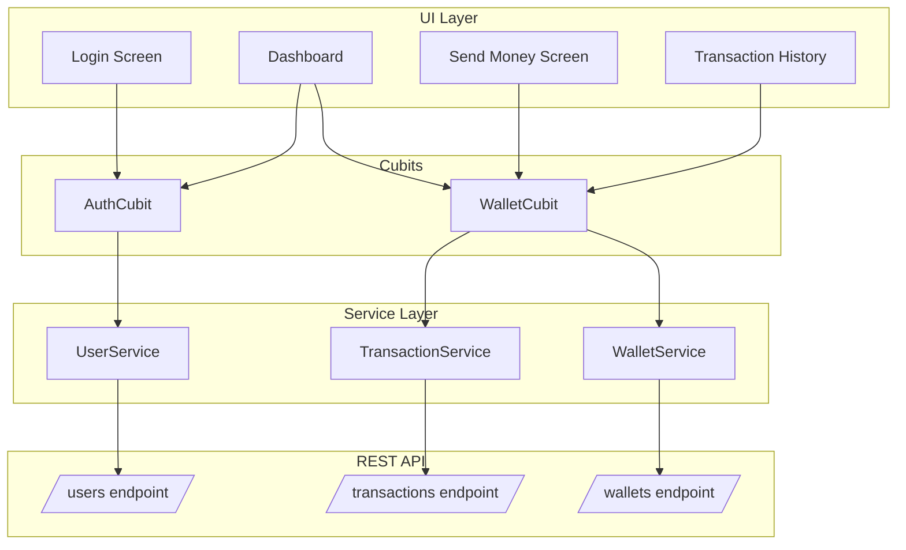

# SendMoney App Architecture

```mermaid
%%{init: {'theme': 'default', 'themeVariables': {'primaryColor': '#4CAF50', 'edgeLabelBackground':'#ffffff', 'tertiaryColor': '#f9f9f9'}}}%%

graph TD
%% UI Layer
subgraph UI Layer
LoginScreen[Login Screen]
Dashboard[Dashboard]
SendMoneyScreen[Send Money Screen]
TransactionHistoryScreen[Transaction History]
end

%% Cubit Layer
subgraph State Management [Cubits]
AuthCubit[AuthCubit]
WalletCubit[WalletCubit]
end

%% Service Layer
subgraph Service Layer
UserService[UserService]
WalletService[WalletService]
TransactionService[TransactionService]
end

%% Backend
subgraph Backend [REST API]
APIUser[/users endpoint/]
APIWallet[/wallets endpoint/]
APITransaction[/transactions endpoint/]
end

%% UI ↔️ Cubits
LoginScreen --> AuthCubit
SendMoneyScreen --> WalletCubit
TransactionHistoryScreen --> WalletCubit
Dashboard --> WalletCubit
Dashboard --> AuthCubit

%% Cubits ↔️ Services
AuthCubit --> UserService
WalletCubit --> WalletService
WalletCubit --> TransactionService

%% Services ↔️ Backend
UserService --> APIUser
WalletService --> APIWallet
TransactionService --> APITransaction

```

