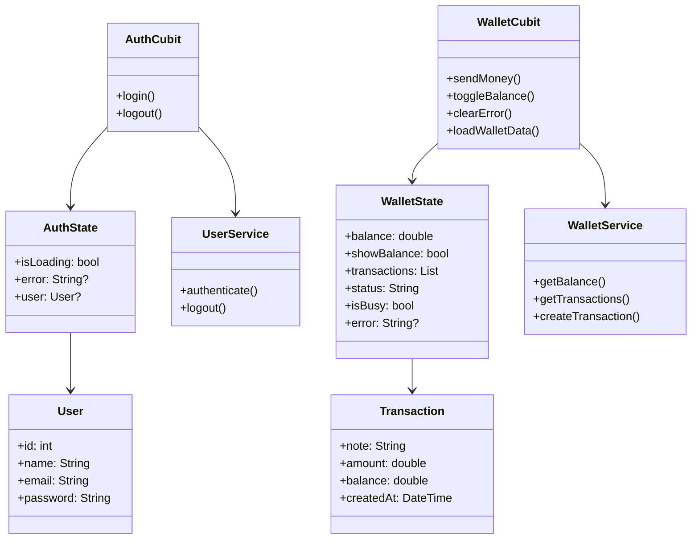

### SendMoney App - Class Diagram

```mermaid
%%{init: {'theme': 'default', 'themeVariables': {'primaryColor': '#4CAF50', 'edgeLabelBackground':'#ffffff', 'tertiaryColor': '#f9f9f9'}}}%%

classDiagram

%% ==== Blocs / Cubits ====
class AuthCubit {
+login()
+logout()
}

class WalletCubit {
+sendMoney()
+toggleBalance()
+clearError()
+loadWalletData()
}

%% ==== State Classes ====
class AuthState {
+isLoading: bool
+error: String?
+user: User?
}

class WalletState {
+balance: double
+showBalance: bool
+transactions: List<Transaction>
+status: String
+isBusy: bool
+error: String?
}

%% ==== Models ====
class User {
+id: int
+name: String
+email: String
+password: String
}

class Transaction {
+note: String
+amount: double
+balance: double
+createdAt: DateTime
}

%% ==== Services ====
class UserService {
+authenticate()
+logout()
}

class WalletService {
+getBalance()
+getTransactions()
+createTransaction()
}

%% ==== Relationships ====
AuthCubit --> AuthState
AuthCubit --> UserService
WalletCubit --> WalletState
WalletCubit --> WalletService
WalletState --> Transaction
AuthState --> User
```